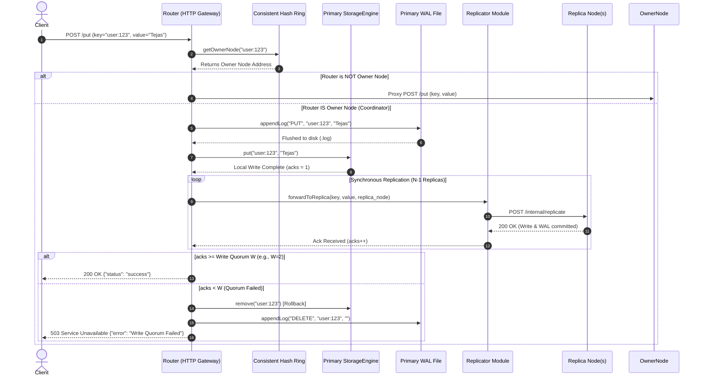

# 🎤 Distributed Key-Value Store: System Design & Architecture Interview

> **Obsidian Note**  
> **Tags:** `#distributed-systems` `#system-design` `#cpp` `#database` `#concurrency` `#interview-notes`  
> **Project:** Tejas-DB (Masterless Distributed Key-Value Store)  
> **Date:** August 31, 2026  

---

## ❓ Interview Question

**Interviewer:**  
> *"Explain the complete architecture of your distributed key-value database. Start from the moment a client sends `PUT("user:123", "Tejas")`. Walk me through exactly what happens—from receiving the request until the write is considered successful."*

---

## 🗣️ Candidate Response & Architectural Deep Dive

### 1. High-Level Architecture Overview

**Tejas-DB** is a highly concurrent, fault-tolerant, masterless distributed Key-Value store implemented in **Modern C++ (C++17)**. It is heavily inspired by Amazon's **Dynamo** and **Apache Cassandra** architectures.

#### Key Architectural Pillars:
* **Masterless Ring Topology:** No single point of failure; every node can act as an API Gateway / Coordinator.
* **Consistent Hashing with Virtual Nodes:** Utilizes 64-bit FNV-1a hashing with 100 vNodes per physical server for uniform load distribution.
* **Strict Quorum Consensus ($N, W, R$):** Configurable replication factor ($N$), Write Quorum ($W$), and Read Quorum ($R$). Defaults to $N=3, W=2, R=2$.
* **Thread-Safe Storage Engine:** Custom In-Memory LRU Cache backed by `std::shared_mutex` (Read-Write Lock) and background TTL Garbage Collector.
* **Durability via Write-Ahead Logging (WAL):** Immediate file flush (`std::ofstream::flush`) before memory insertion for zero-data-loss crash recovery.
* **Gossip Protocol:** Background heartbeat threads for automated node failure detection and ring topology updates.

---

## 🗺️ End-to-End Sequence Diagram



---

## 🔬 Step-by-Step Lifecycle of `PUT("user:123", "Tejas")`

---

### Step 1: Network Ingress & Request Parsing (`Router.cpp`)

1. **HTTP Listener:** The client issues an HTTP POST request to `/put` with form parameters `key=user:123` and `value=Tejas`.
2. **Worker Thread Handling:** `cpp-httplib` receives the incoming TCP connection on a dedicated thread pooled by the OS kernel.
3. **CORS & Validation:** The `Router::setupRoutes()` handler verifies that both `key` and `value` parameters are present in the HTTP payload.
4. **Consensus Config Retrieval:** The coordinator acquires a `std::shared_lock` on `global_config.config_lock` to read current cluster rules ($N, W, R$).

```cpp
// Code Snippet from src/network/Router.cpp
std::string key = req.get_param_value("key");
std::string value = req.get_param_value("value");

int current_W, current_N;
{
    std::shared_lock<std::shared_mutex> lock(global_config.config_lock);
    current_W = global_config.W;
    current_N = global_config.N;
}
```

---

### Step 2: Consistent Hashing Ring Lookup (`ConsistentHash.cpp`)

1. **Hash Calculation:** The Router calls `hashRing->getOwnerNode("user:123")`.
2. **FNV-1a Hash Algorithm:** The string `"user:123"` is hashed into a 64-bit unsigned integer using the FNV-1a non-cryptographic hash function:
   $$\text{hash} = (\text{hash} \oplus c) \times 1099511628211$$
3. **Binary Search on Hash Ring:** The system searches its `std::map<size_t, std::string> hashRing` using `upper_bound(hash_val)` under a `std::shared_lock<std::shared_mutex>`.
4. **Clockwise Ownership:** `upper_bound` finds the first virtual node whose hash value is greater than the key's hash value. If it hits `hashRing.end()`, it wraps around to `hashRing.begin()` (360° ring topology).
5. **Coordinator Routing Decision:**
   * **If Current Node $\neq$ Owner Node:** The current node acts as a proxy gateway, executing an HTTP POST to `http://<ownerNode>/put` and returning the response to the client.
   * **If Current Node $=$ Owner Node:** The current node assumes the role of **Coordinator** for this request and proceeds to local persistence and replication.

```cpp
// Code Snippet from src/core/ConsistentHash.cpp
size_t ConsistentHash::computeHash(const std::string& key) {
    size_t hash = 14695981039346656037ULL; // FNV offset basis
    for (char c : key) {
        hash ^= static_cast<size_t>(c);
        hash *= 1099511628211ULL;          // FNV prime
    }
    return hash;
}

std::string ConsistentHash::getOwnerNode(const std::string& key) {
    std::shared_lock<std::shared_mutex> lock(ring_lock);
    if (hashRing.empty()) return "";

    size_t hash_val = computeHash(key);
    auto it = hashRing.upper_bound(hash_val);
    if (it == hashRing.end()) it = hashRing.begin();

    return it->second;
}
```

---

### Step 3: Durability First — Write-Ahead Logging (WAL) (`WAL.cpp`)

Before mutating in-memory data structures, the coordinator writes the operation to disk to guarantee crash recovery:

1. **File Lock:** Acquires an exclusive `std::lock_guard<std::mutex> file_lock`.
2. **Log Formatting:** Formats the record as `PUT,user:123,Tejas\n`.
3. **Immediate Disk Flush:** Appends to `logFile` and calls `logFile.flush()`. This bypasses OS-level buffer caches so that if power drops right after this line, the data remains safely on persistent storage.

```cpp
// Code Snippet from src/core/WAL.cpp
void WAL::appendLog(const std::string& action, const std::string& key, const std::string& value) {
    std::lock_guard<std::mutex> lock(file_lock);
    logFile << action << "," << key << "," << value << "\n";
    logFile.flush(); // Critical for zero data loss on node crash
}
```

---

### Step 4: In-Memory Storage Mutation & LRU Eviction (`StorageEngine.cpp`)

Once logged to WAL, the coordinator writes the key-value pair to RAM:

1. **Exclusive Write-Lock:** Acquires an exclusive `std::unique_lock<std::shared_mutex> rw_lock`.
2. **LRU Capacity Verification:** If `dataStore.size() >= capacity` and the key is new, `evictOldest()` is invoked. The least recently used key at the back of `std::list<std::string> lruQueue` is popped, and its entries in `dataStore` and `lruMap` are deleted.
3. **Data & Tracker Insertion:**
   * `dataStore["user:123"] = Record{ "Tejas", expiry_time }`
   * Key `"user:123"` is pushed to the front of `lruQueue`.
   * Iterator to the list front is saved in `lruMap["user:123"]`.
4. **Local Ack:** `acks` count is initialized to `1` (representing the primary coordinator's local write).

```cpp
// Code Snippet from src/core/StorageEngine.cpp
void StorageEngine::put(const std::string& key, const std::string& value, int ttl_seconds) {
    std::unique_lock<std::shared_mutex> lock(rw_lock); // Exclusive Write Lock

    long long expiry = (ttl_seconds > 0) ? (getCurrentTime() + ttl_seconds) : 0;

    if (dataStore.find(key) != dataStore.end()) {
        dataStore[key] = {value, expiry};
        lruQueue.erase(lruMap[key]);
        lruQueue.push_front(key);
        lruMap[key] = lruQueue.begin();
        return;
    }

    if (dataStore.size() >= capacity) {
        evictOldest();
    }

    dataStore[key] = {value, expiry};
    lruQueue.push_front(key);
    lruMap[key] = lruQueue.begin();
}
```

---

### Step 5: Quorum Replication Across Cluster Nodes (`Replicator.cpp`)

To satisfy fault tolerance ($N=3, W=2$), the coordinator replicates the write across secondary nodes:

1. **Physical Peer Discovery:** The coordinator queries `hashRing->getUniquePhysicalNodes()` to find active replica targets.
2. **Synchronous HTTP Fan-Out:** For each peer node (up to $N-1$ targets), the coordinator invokes `replicator->forwardToReplica("user:123", "Tejas", node, ttl)`.
3. **Replica Processing (`/internal/replicate`):**
   * The target replica receives the payload via HTTP POST.
   * Target replica writes to its local WAL (`wal->appendLog`).
   * Target replica inserts into its local `StorageEngine` (`storage->put`).
   * Target replica returns `200 OK`.
4. **ACK Accumulation:** Each successful `200 OK` response increments `acks++`.

```cpp
// Code Snippet from src/cluster/Replicator.cpp
bool Replicator::forwardToReplica(const std::string& key, const std::string& value, const std::string& targetNode, int ttl) {
    size_t colonPos = targetNode.find(':');
    std::string host = targetNode.substr(0, colonPos);
    int port = std::stoi(targetNode.substr(colonPos + 1));

    httplib::Client cli(host, port);
    cli.set_connection_timeout(2, 0); // 2-second timeout for Strict Quorum

    httplib::Params params;
    params.emplace("key", key);
    params.emplace("value", value);
    if (ttl > 0) params.emplace("ttl", std::to_string(ttl));

    auto res = cli.Post("/internal/replicate", params);
    return (res && res->status == 200);
}
```

---

### Step 6: Consensus Verification & Failure Rollback (`Router.cpp`)

The coordinator evaluates if the Write Quorum requirement ($W$) was satisfied:

1. **Quorum Satisfied ($acks \ge W$):**
   * Returns HTTP `200 OK` with JSON `{"status": "success"}` to the client.
   * The write is officially committed and guaranteed consistent across $W$ nodes.
2. **Quorum Failed ($acks < W$):**
   * **Atomic Rollback:** To prevent dirty/phantom writes on the primary node when consensus fails, the coordinator rolls back its local state:
     * `storage->remove("user:123")`
     * `wal->appendLog("DELETE", "user:123", "")`
   * Returns HTTP `503 Service Unavailable` with JSON `{"error": true, "message": "Write Quorum Failed"}`.

```cpp
// Code Snippet from src/network/Router.cpp
int effective_W = std::min(current_W, static_cast<int>(activeNodes.size()));

if (acks >= effective_W) {
    res.status = 200;
    res.set_content(R"({"status": "success"})", "application/json");
} else {
    // Quorum Failure Compensation / Local Rollback
    storage->remove(key); 
    wal->appendLog("DELETE", key, ""); 
    res.status = 503; 
    res.set_content(R"({"error": true, "message": "Write Quorum Failed"})", "application/json");
}
```

---

## 🛠️ Background Maintenance & System Resilience

### 1. Failure Detection via Gossip Protocol (`Gossip.cpp`)
* A background thread (`heartbeatThread`) loops continuously, sending `/ping` requests to peer nodes every 2 seconds.
* If a node fails to respond 3 consecutive times, Gossip marks it dead and calls `hashRing->removeNode(peerAddress)`.

### 2. TTL Cleanup & Garbage Collection (`StorageEngine.cpp`)
* **Lazy Eviction:** Evaluated on `get(key)` calls. If `expiry_time < now`, the key is immediately purged and `std::nullopt` is returned.
* **Active Garbage Collector:** A dedicated OS thread (`cleanup_thread`) wakes up every 1 second, locks `rw_lock`, and purges expired records from `dataStore`, `lruQueue`, and `lruMap`.

### 3. Elastic Rebalancing (`/admin/rebalance`)
* When a new node joins the cluster, nodes scan their local `dataStore` for keys whose `getOwnerNode(key)` now points to the new node.
* Matching keys are packed into JSON and transferred via `/internal/transfer` without cluster downtime.

---

## 📊 Key Performance Metrics

Benchmarked with **50,000 requests** under **100 concurrent threads** (Apache Bench `ab -n 50000 -c 100`):

| Metric | Write (POST `/put`) | Read (GET `/get`) |
| :--- | :--- | :--- |
| **Throughput** | **33,684.94 req/sec** | **1,809.14 req/sec** |
| **Mean Latency** | **2.969 ms** | **55.275 ms** |
| **P95 Latency** | **4.00 ms** | **72.00 ms** |
| **P99 Latency** | **5.00 ms** | **73.00 ms** |
| **Success Rate** | **100% (0 errors)** | **100% (0 errors)** |

---

## 🎯 Summary Checklist for Interviewers

* **Concurrency & Synchronization:** `std::shared_mutex` for Reader-Writer locking, `std::mutex` for WAL file safety, `std::atomic<bool>` for thread loops.
* **Consistency & Replication:** Strict Quorum ($N=3, W=2, R=2$) with compensation rollbacks.
* **Durability:** Write-Ahead Logging with explicit disk flushes before memory writes.
* **Partitioning:** Consistent Hashing with 100 vNodes & FNV-1a hashing.
* **High Availability:** Masterless design with Gossip heartbeat monitoring.
